# Ejercicio 3_7

## 1
Nuestro compañero nos pasará un enlace del repositorio, usaremos fork para crear una copia del repositorio para mi mismo.  
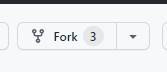

## 2
Luego, clonaremos el respositorio para trabajar con él de forma local. Haremos algunos cambios y le haremos un push para subirlo a github. 
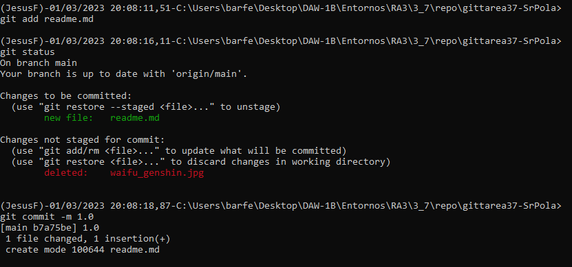  
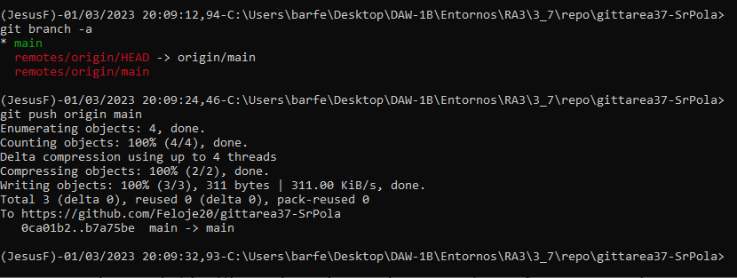

## 3
Después de tener nuestro repositorio en github, tendremos que crear un pull request para solicitar la integración de nuestros cambios en el repo. 
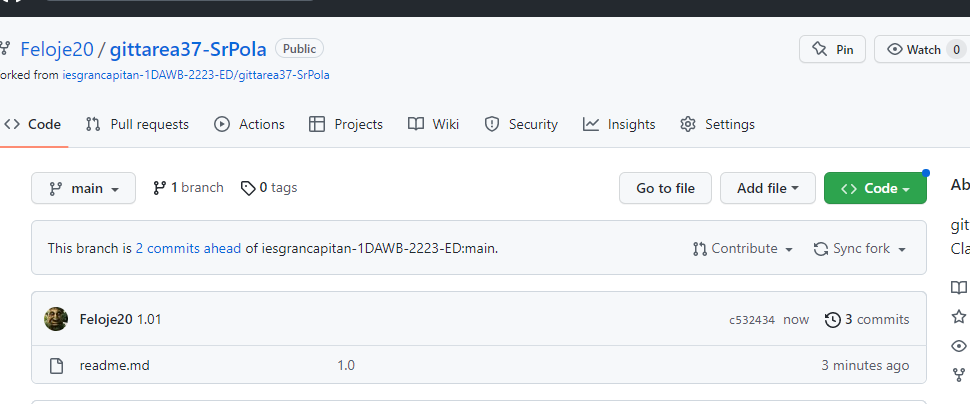  
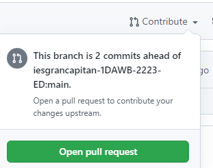  
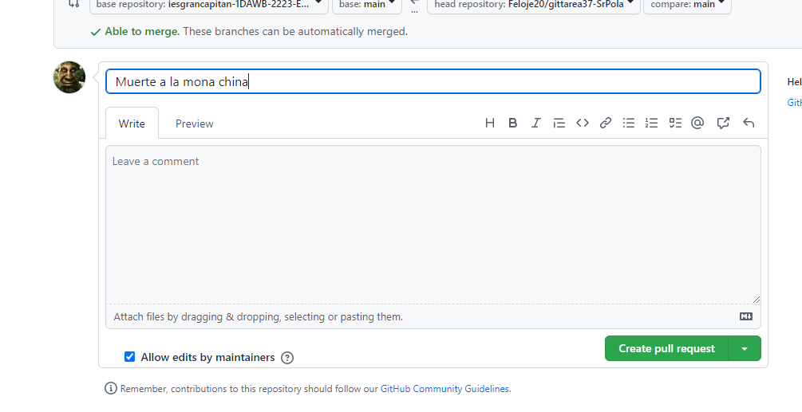  
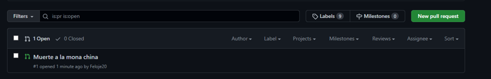

## 4
Aquí podemos ver el repositorio de nuestro compañero antes de que acepte la pull request. 
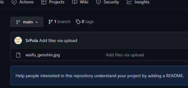

## 5
Lo único que tendrá que hacer nuestro compañero es revisar nuestro pull request, y aceptar el merge con su repositorio para recibir nuestros cambios. 
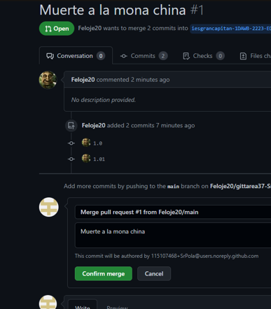 
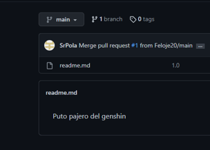

## 6
En la pestaña de insight/network, podemos apreciar los cambios que se han producido en el repositorio de forma gráfica. 
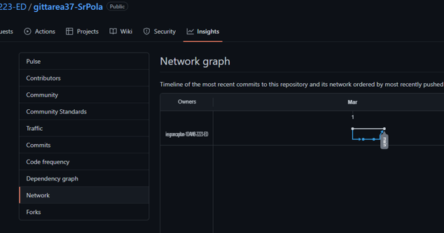